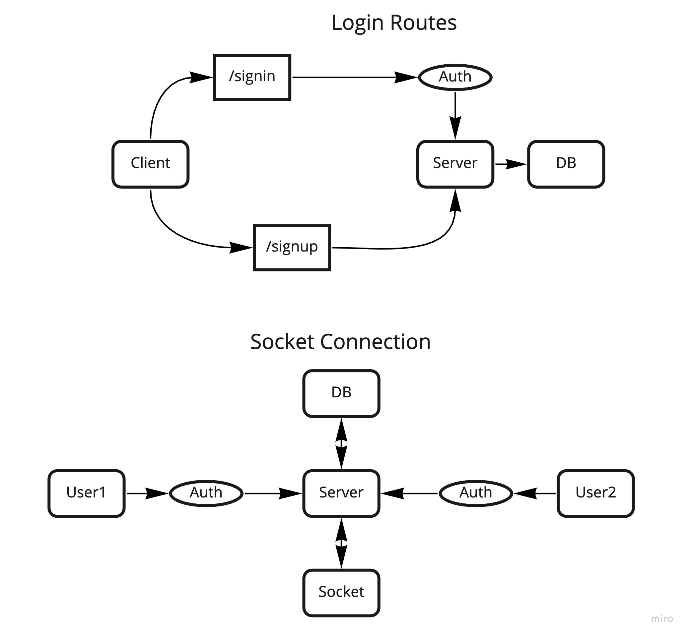

# Software Requirements

## Vision

1. What is the vision of this product?  
  To be able to easily, and privately, chat with friends. The idea of this project is to make a private messaging web app that would use socket.io to instantaneously send messages back and forth. This would not use a database, and would instead use local machine storage (caching).
2. What pain point does this project solve?  
  There are a lot of messaging apps out there but this one would allow users to keep the message history more private by using the cache. The user would be able to delete messages on their end and would not have to fear that someone can find their info online. We would use a database to store users and their passwords. We would encode their passwords and other sensitive information.
3. Why should we care about your product?  
  Privacy is an ever-increasing concern as we settle into a new digital age. Our proposed approach to messaging will be encrypted, peer-to-peer, and will not be stored on any server, providing private communication for all interested parties.

## Scope (In/Out)

IN - What will your product do.

* Individual Features
  * Signup
    * A user account is created in the database.
  * Signin
    * A user can log back in to a previously created user account.
  * Messaging
    * A user can send and receive messages to another user.
  * Locally persisting data
    * Messages are only stored on the client's machine, and never in a database.

OUT - What will your product not do.

* This project will not have a front-end.

## Minimum Viable Product (MVP)

MVP for this project would be having a working messaging system. Users will be able to add friends, connecting to other users.

## Stretch Goals

Implementing chat rooms with multiple users.

## Functional Requirements

1. A user can update their profile information.
2. A user can add another user to their friend's list.
3. A user can send a message to a friend.
4. A user can view a history of sent and received messages with a friend.

### Data Flow

* When a user signs up or signs in, they get authenticated by the server prior to being able to access their locally stored information and settings.
* A user submits a message to be sent, the message is encrypted, then sent to the server with the recipient's information.
* The server emits the message to the intended recipient.
* The recipient stores the information locally, and sends a received response back to the server.
* The server send the received response to the sender.

## Non-Functional Requirements

* Security - encryption of messages and authorization
* Testability
  * Authorization - Users can signup, and access their accounts.
  * Encryption and messaging - Messages can be successfully encrypted, transmitted, and decrypted.
  * Database - User accounts can be successfully created and accessed.
